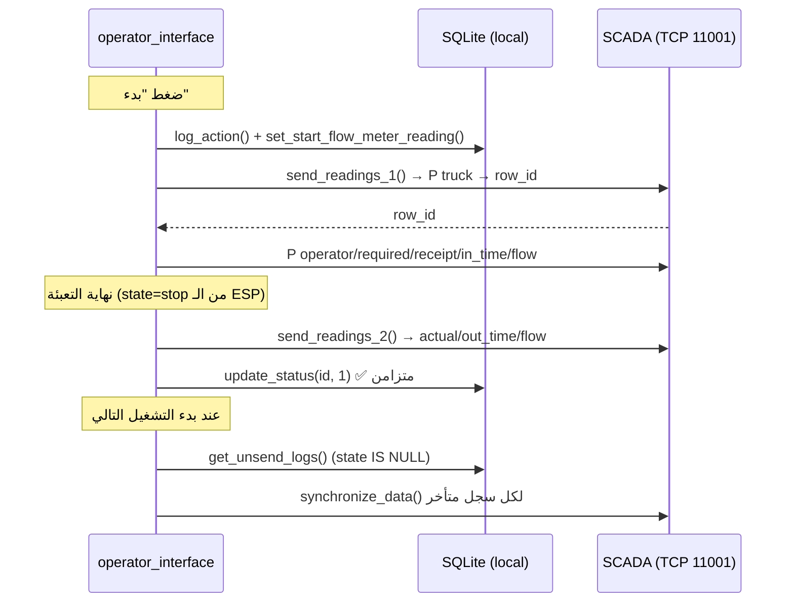

# شرح الـ Sync مع السيرفرات + نظام الباركود

> توثيق تقني لكود `src/database.py` و `src/operator_interface.py`.
> يشرح: (1) مزامنة بيانات التعبئة مع السيرفر الخارجي وخطوات الإرسال والفشل، و(2) دورة عمل الباركود.

---

## نظرة عامة: فيه **سيرفرين** خارجيين

التطبيق بيتكلم مع نظامين منفصلين تماماً، ولكل واحد بروتوكول مختلف:

| # | السيرفر | العنوان | البروتوكول | الغرض |
|---|---------|---------|-----------|-------|
| 1 | **SCADA / SQL Server** | `<server_address>:11001` | TCP نصّي (رسائل `P`) | إرسال قراءات التعبئة (فتح/غلق/عداد) |
| 2 | **Receipt API** | `http://172.16.0.99:8090/KorapTmp` | HTTP REST (JSON) | جلب الإيصالات والتحقق منها وتعليمها كمستهلَكة |

قاعدة البيانات المحلية `SQLite` هي **مصدر الحقيقة المؤقت**: كل عملية بتتسجّل محلياً الأول، وبعدين تتزامن مع السيرفرات. لو الشبكة وقعت، البيانات بتفضل محلياً لحد ما ترجع الشبكة.

---

# الجزء الأول: المزامنة مع سيرفر SCADA (TCP)

الكلاس المسؤول: [`TcpConnectionManager`](src/database.py#L471) في `database.py`.

## 1. إدارة الاتصال (Connection lifecycle)

| الدالة | الوظيفة |
|--------|---------|
| [`_create_new()`](src/database.py#L492) | ينشئ socket جديد ويتصل بـ `ip:11001` مع `timeout=3` ثواني |
| [`_is_alive()`](src/database.py#L510) | يتأكد إن الـ socket شغّال (يبعت بايت فاضي `b''`) |
| [`get_connection()`](src/database.py#L522) | يرجّع socket جاهز، ولو وقع يحاول **reconnect حتى 3 مرات** (ثانية بين كل محاولة) |
| [`reconnect()`](src/database.py#L551) | يقفل الاتصال القديم وينشئ واحد جديد |
| [`close_connection()`](src/database.py#L539) | يقفل الاتصال بأمان |

- `ip` و `port` بيتقرّوا من جدول `addresses` المحلي وقت الإنشاء ([`__init__`](src/database.py#L473)). الـ port ثابت `11001`.
- كل عمليات الإرسال متحمية بـ `self._tx_lock` عشان **مايبقاش فيه إرسالين في نفس الوقت** على نفس الـ socket.

## 2. البروتوكول النصّي

كل رسالة على الشكل:

```
P <channel_id> <value> <row_id>\n
```

- `P` = نوع الرسالة (Put / إدخال قيمة).
- `<channel_id>` = رقم القناة على السيرفر لكل حقل (اسم عربية، عداد، وقت...). بيتقرا من جدول [`channel_entry`](src/database.py#L1508) حسب المنفذ.
- السيرفر بيرد بـ **رقم صف (`row_id`)** لو الرسالة أنشأت صف جديد، أو تأكيد. الدالة [`send_receive()`](src/database.py#L556) بتبعت وتستقبل (`recv 1024`).
- أول رسالة (رقم العربية) بترجّع `row_id` اللي بيتربط بيه باقي الحقول.

## 3. خطوات الإرسال

### أ) عند بدء التعبئة → [`send_readings_1(id, current_flowmeter_value)`](src/database.py#L568)

```
1. get_connection()  ─────────────► لو فشل: يسجّل خطأ ويرجّع None
2. اقرأ اللوج من SQLite (get_log_by_id)
3. اقرأ قنوات المنفذ (channel_entry) ─► لو مش 9 حقول: خطأ ويرجّع None
4. P <truck_ch> <truck_number> null   ─► السيرفر يرجّع row_id (لازم يكون رقم)
5. خزّن row_id محلياً (add_row_id_to_logs)
6. أرسل بالتتابع (كل واحد لو موجود):
      operator_id / required_quantity / receipt_number / in_time
7. P <flowmeter_ch> <current_flow> null null ─► يرجّع flow_id
8. P <flow_time_ch> <in_time> null <flow_id>
```

يُستدعى من [`log_server_data()`](src/operator_interface.py#L1479) لحظة الضغط على "بدء".

### ب) عند نهاية التعبئة → [`send_readings_2(id)`](src/database.py#L645)

```
1. get_connection()
2. اقرأ اللوج والقنوات
3. لو مفيش row_id (البداية ما اتبعتتش) ─► اعمل Start الأول (P truck → row_id)
4. أرسل: actual_quantity / out_time / final flowmeter (→ flow_id) / flow_time
5. update_status(id, 1)   ◄──── تعليم السجل كـ "متزامن"
```

يُستدعى من [`log_server_data2()`](src/operator_interface.py#L1783) بعد ما المنفذ يقفل.

### ج) مزامنة السجلات المتأخرة (Offline backlog) → [`synchronize_data(records)`](src/database.py#L764)

- بتشتغل **مرة عند بدء التطبيق** لو الاتصال شغّال ([operator_interface.py:389](src/operator_interface.py#L389)).
- بتجيب كل السجلات غير المتزامنة عبر [`get_unsend_logs()`](src/database.py#L1370) — وهي اللي `state IS NULL`.
- بتلفّ عليهم مع **نافذة تقدّم (Progress dialog)** قابلة للإلغاء، وبتبعت التسلسل الكامل لكل سجل، وتعلّمه `status=1`.

## 4. التعامل مع الفشل

| الموقف | التصرّف الحالي |
|--------|----------------|
| فشل إنشاء الـ socket | `get_connection()` يرجّع `None` → العملية تتوقف وتسجّل `"Cannot send message: TCP is not connected."` |
| الـ socket وقع أثناء الإرسال | [`send_receive`](src/database.py#L556) يمسك الاستثناء → `reconnect()` → يرجّع `None` |
| رد `row_id`/`flow_id` مش رقم | يسجّل خطأ ويوقف السجل الحالي (`return`/`continue`) |
| فشل سجل واحد في الـ backlog | `try/except` حواليه → يكمّل باقي السجلات ([database.py:894](src/database.py#L894)) |
| **إعادة المحاولة الأساسية** | أي سجل يفضل `state=NULL` لحد ما يتزامن بنجاح (`status=1`) → **يُعاد إرساله تلقائياً في بدء التشغيل التالي** |

> آلية إعادة المحاولة الحقيقية = "السجل يفضل غير متزامن لحد ما ينجح، ويتحاول تاني عند التشغيل". مفيش إعادة محاولة دورية أثناء التشغيل نفسه.

## 5. تدفّق كامل (Sequence)



---

# الجزء الثاني: المزامنة مع Receipt API (HTTP)

3 نقاط تعامل، كلها في [`sqlliteConnectionManager`](src/database.py#L906):

### أ) جلب الإيصالات → [`get_receipts_from_api()`](src/database.py#L1807)

```
GET http://172.16.0.99:8090/KorapTmp/today?from=<أمس>&to=<غدًا>   (timeout=3)
→ INSERT OR IGNORE في جدول receipts المحلي
```

بيتنادى في: بدء التطبيق، **كل ساعة** عبر [`refresh_receipts_from_api()`](src/operator_interface.py#L464)، وعند إدخال إيصال غير موجود.

### ب) تعليم الإيصال كمستهلَك → [`update_receipt_status()`](src/database.py#L1781)

```
POST http://172.16.0.99:8090/KorapTmp/Consume   (JSON, timeout=3)
→ ثم UPDATE receipts SET checked=1 محلياً
→ ثم تحديث ملف Excel
```

### ج) التحقق محلياً → [`check_receipt()`](src/database.py#L1773)

بيقرا `(checked, water_quantity)` من جدول `receipts` المحلي (من غير شبكة).

### التعامل مع الفشل (HTTP)

| الموقف | التصرّف |
|--------|---------|
| فشل POST الـ Consume | يسجّل خطأ **لكن يكمّل ويعلّم `checked=1` محلياً** ([database.py:1794](src/database.py#L1794)) |
| فشل GET today | مغطّى بـ `try/except` في المستدعي |

> ⚠️ **ملاحظة موثوقية:** في [`update_receipt_status`](src/database.py#L1781) لو فشل الـ POST على السيرفر، الإيصال **بيتعلّم مستهلَك محلياً برضه**. يعني ممكن يبقى مستهلَك عندك ومش مستهلَك على السيرفر. يُفضَّل تأجيل التعليم المحلي أو إضافة queue لإعادة الإرسال.

---

# الجزء الثالث: نظام الباركود

## 1. اختيار الوضع

- زر الراديو "باركود" ([operator_interface.py:877](src/operator_interface.py#L877)) هو **الوضع الافتراضي** (`setChecked(True)`).
- في وضع الباركود ([`change_mode`](src/operator_interface.py#L1278)): حقل الإيصال **مفعّل**، وزر "بدء" **معطّل** (التشغيل تلقائي بعد المسح).

## 2. دورة العمل

```
المشغّل يمسح الباركود في حقل الإيصال
        │  (returnPressed / Enter)
        ▼
on_receipt_entered(port)        ← يعمل فقط في وضع barcode
        │
        ▼
receipt_check(receipt, port)    ← التحقق + الملء التلقائي + بدء التعبئة
```

- الربط: [`receipt_number_entry.returnPressed.connect(on_receipt_entered)`](src/operator_interface.py#L1177)
- [`on_receipt_entered()`](src/operator_interface.py#L1372): يتأكد إن الوضع `barcode`، وإن الحقل مش فاضي، وينادي `receipt_check`.

## 3. منطق التحقق → [`receipt_check()`](src/operator_interface.py#L1336)

بالترتيب:

| الحالة | الشرط | التصرّف |
|--------|-------|---------|
| **وضع الأزمات** | الإيصال = `operator_id` | تعبئة طوارئ بدون إيصال — **مرة واحدة للعربية في اليوم** ([سطر 1338](src/operator_interface.py#L1338)) |
| **غير موجود** | `checked` = `None` | تحذير + `get_receipts_from_api()` (تحديث) + توقّف |
| **مستخدَم بالفعل** | `checked` = 1 | تحذير "الإيصال مستخدم بالفعل" + توقّف |
| **صالح** | فيه إيصال وكمية | ملء حقلي الإيصال والكمية → **`start_filling()` تلقائياً** |

## 4. تفاصيل وضع الأزمات (Azmat)

- لو المشغّل دخّل **رقمه الشخصي (operator_id)** بدل رقم إيصال:
  - يقرأ الكمية من حقل `add_quantity_entry` يدوياً.
  - يتأكد إن العربية **ماتملتش النهارده في وضع الأزمات** عبر `get_truck_today()` / `set_truck_today()`.
  - لو اتملت قبل كده النهارده → خطأ "تم ملئ هذه السيارة مرة في وضع الاذمات اليوم" وتوقّف.

## 5. بعد التحقق الناجح

`receipt_check` ينادي [`start_filling()`](src/operator_interface.py#L1387) اللي:
1. يمنع التكرار خلال 5 ثواني.
2. يتحقق من الحقول واتصال المنفذ والكمية القصوى ورقم العربية وحد العربية اليومي.
3. يسجّل محلياً وينشر MQTT (`quantity` + `state=start`) ويستدعي `send_readings_1` (الجزء الأول).

---

## ملاحظات ومخاطر مختصرة (للصيانة)

1. **[send_readings_1:610](src/database.py#L610):** `if not row_id.isdigit()` — لو رجع السيرفر `None` (فشل الرد) هيحصل `AttributeError`. يُفضّل فحص `if not row_id or not row_id.isdigit()` زي ما هو معمول في `send_readings_2`.
2. **تعليم الإيصال محلياً رغم فشل السيرفر** (مذكور فوق).
3. **ضوضاء اللوج:** إعادة محاولات TCP كانت بتغرق `app.log` (اتعملها فلتر في `operator_interface.py`).
4. **البورت ثابت `11001`** في الكود مش في الإعدادات.
